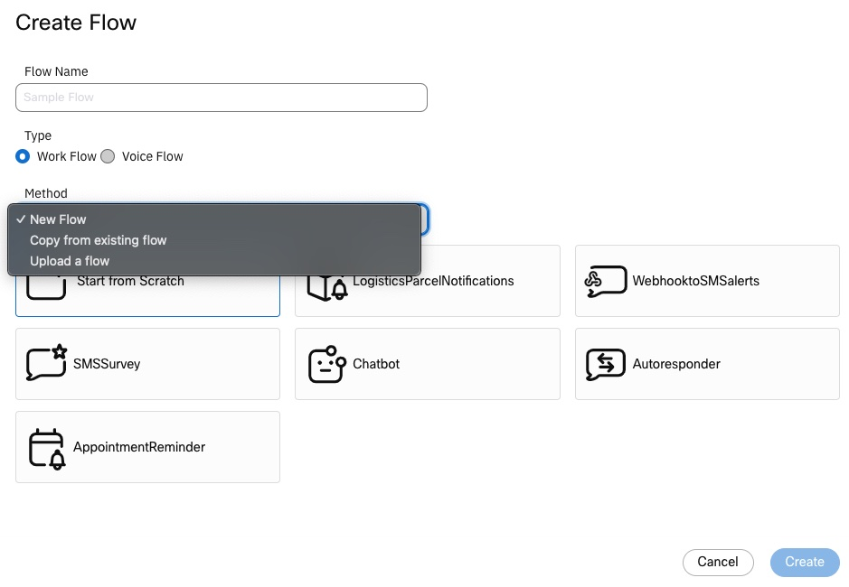
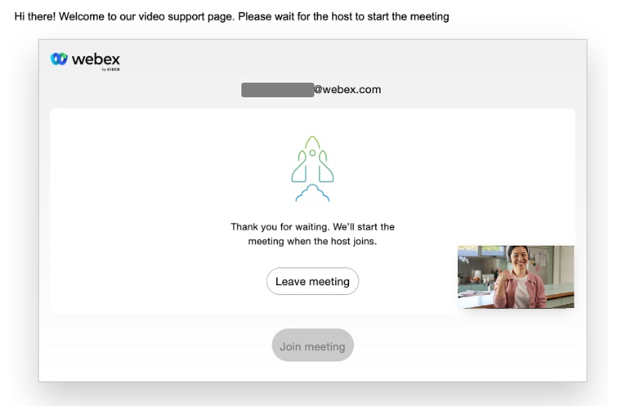
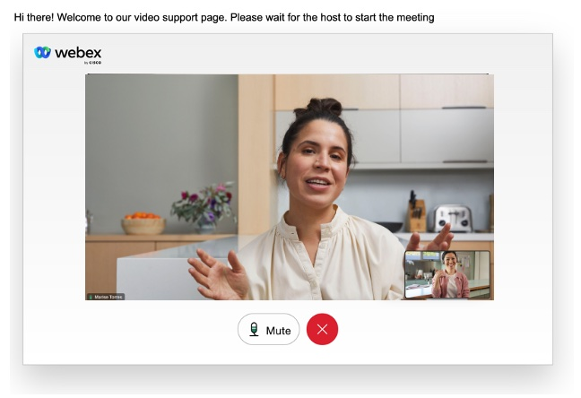

# Create Meeting Webex Connect flow

This is a flow designed to schedule a Webex Meeting that could be used to provide end customer support with Video. 

## Table of Contents

- [Overview](#overview)
- [Prerequisites](#prerequisites)
- [Setup](#setup)
- [User Experience](#user-experience)
- [License](#license)
- [Disclaimer](#disclaimer)
- [Contact](#contact)


## Overview
The Webex Connect flow will create two **meetings links**:

- One for the expert (host link)
- One for the customer (guest link)

The expert can join from the Webex App, or from a video device. A regular Webex Meeting is used. The expert will also get email invites with meeting details.

The customer will join from a web browser, using the guest link provided, and from any device (Windows OS, MAC OS, iOS, Android) as long as an updated version of the browser (Chrome, Safari, Firefox, Edge) is used.


This flow is designed to be used as child flow. Go to the [Setup section](#parent-flow-setup) below for more details.


## Prerequisites

- Webex ORG with Webex Meetings enabled. You can get a developer sandbox for free at: https://developer.webex.com/docs/developer-sandbox-guide

- Webex Connect tenant: You can get a developer sandbox for free at: https://developer.webex.com/docs/webex-connect


## Setup

### Create a Service App with the right scopes to schedule Webex Meetings

1. Log in the [Webex for developers](https://developer.webex.com/) web site as a Webex administrator in your Webex ORG

2. Click on **Start Building Apps** and on **Create a Service App**

3. Choose the App Name, Icon, Contact Email, and a good description, like for example "Service App for Webex Meetings scheduling"

4. Select the `meeting:schedules_write` and `meeting:admin_schedule_write` scopes

5. Click on **Add Service App**

6. Save your **Client ID** and **Client Secret** somewhere safe


  Do not close this window, you will need to come back here later

### Authorize your new Service App

1. Log in [Control Hub](https://admin.webex.com)  as a Webex administrator in your Webex ORG

2. Go to Apps, and click on **Service Apps**. Your new Service App should be listed

3. Click on the Service App, and enable it by clicking on the **Authorize** toggle switch. If you have more than one webex site in your org, choose in what site you want to authorize the Service App

4. Click on **Save**

### Get the Service App Access token

1. Go back to Service App creation web page, and refresh it.

2. Under **Authorized orgs**, choose your Webex ORG,  paste your Service App Client Secret, and click on **Generate Tokens**. Store the `access_token` somewhere safe

### Create the Webex Connect flow

1. Download the [flow](connect-flow.workflow)

2. Create a new flow by importing the downloaded flow, with the option **Upload a flow**

    

3.  Type a name for your Webhook in the **Name** box. For example, you can use 'get-meeting-links'. Click on **Save**

4. Edit the **Custom Variables**. For the variable `MeetingSchedulerServiceAppToken`, use the your Service App Access Token

  > NOTE: The Service App access token needs to be refreshed. If you want to use this flow in production, a Webex Connect Custom Integration Node with oAuth configured should be created. You can still use this flow for demo purposes, updating the access token manually

5. Publish the Flow

### Parent Flow Setup

  The provided Webex Connect flow is designed to be used as child flow. In other words, you should build a parent flow with the business logic, and from there call this flow using a **Call Flow** node. You should create the following Custom Variables in the parent Flow:

  - `title`: Webex Meeting title
  - `start`: Webex Meeting start date and time
  - `end`: Webex Meeting end date and time
  - `welcomeMessage`: A short welcome text message that will be shown to the customer. If none is provided, ```"Hi there! Welcome to our video support page. Please wait for the host to start the meeting"``` will be used as default.
  - `expertEmail`: Expert email address. It needs to be a Webex user in your ORG with a Webex Meetings host license

  `start` and `end` dates need to be Java Script Date objects, converted to strings. For example, if you want the meeting to start in 2 minutes, and to finish in 30m, you need to setup an Eval node in your parent flow with the following code:

  ```
  var now = new Date();
  var in2minutes = new Date(now.getTime() + 2 * 60000);
  var thirtyMinutesLater = new Date(now.getTime() + 30 * 60000);
  start = in2minutes.toString();
  end = thirtyMinutesLater.toString();

  ````

  You should create two more Custom Variables: ```hostUrl``` and ```guestUrl``` in the parent flow. These variables will be populated after the execution of the Create Meeting Links child flow.

## User Experience

The meeting link generated by the flow will send the customer to this web page: https://video-support-wxsd.glitch.me 

After joining the meeting, the used will be asked to wait for the expert (host) to join:



When the expert joins  the communication setup is completed:



The web server uses [Rajitha Kantheti](https://github.com/rajithaBK)'s [embeddable Meeting Widget](https://github.com/wxsd-sales/embeddable-meetings-widget/edit/main/README.md) project.


## License

Distributed under the MIT License. See [LICENSE](LICENSE) for more information.

## Disclaimer

Everything included is for demo and Proof of Concept purposes only. Use of the site is solely at your own risk. This site may contain links to third party content, which we do not warrant, endorse, or assume liability for. These demos are for Cisco Webex use cases, but are not Official Cisco Webex Branded demos.
 

## Contact

Please contact the Webex SD team at [wxsd@external.cisco.com](mailto:wxsd@external.cisco.com?subject=CreateMeetingFlow) for questions. Or for Cisco internal, reach out to us on Webex App via our bot globalexpert@webex.bot & choose "Engagement Type: API/SDK Proof of Concept Integration Development". 

